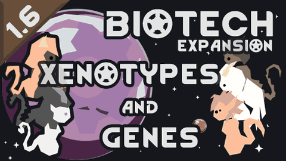

# WVC - Xenotypes and Genes: CE Compatibility

**Now speaking Combat Extended.**

**RimWorld 1.6 | Version 1.0.0**

WVC is packed with strange genes, living armor, natural weapons, and an entire workforce of stone golems. This patch teaches Combat Extended how to handle that arsenal without flattening the personality out of it.

## What it covers

- CE armor and durability for all 14 current golem races.
- Natural armor from WVC genes and hediffs, translated into CE armor values.
- CE-aware melee tools for golems, scythe tails, archite claws, and natural claws.
- The Hunter's stonethrower and hardened-feather projectile paths.
- Conditional Ideology, Anomaly, and legacy content.

## You will need

- [WVC - Xenotypes and Genes](https://steamcommunity.com/sharedfiles/filedetails/?id=2886992038)
- [Combat Extended](https://steamcommunity.com/sharedfiles/filedetails/?id=2890901044)
- Biotech
- RimWorld 1.6

Load this patch after WVC and Combat Extended. Disable the older `Asname.wvcgenece` compatibility patch before enabling this one.

## We tested the fun parts

We loaded the full profile, spawned the golems, assigned an overseer, made them fight, fired the stonethrower, checked hardened feathers, and watched the logs when anything looked suspicious. That does not make every possible gene stack predictable, but it gives this release a real gameplay foundation instead of an XML-only thumbs-up.

## Bug reports

Please include `Player.log`, your active mod list and load order, and the gene, golem, or weapon involved. The Steam Workshop page will be linked here during the launch handoff; GitHub issues are welcome for reproducible technical problems.

## Credits

WVC - Xenotypes and Genes is by Sergkart and contributors. Combat Extended is by the Combat Extended team and contributors. This is an independent compatibility patch by **refusedzero**. No affiliation or endorsement is implied.

See [LICENSE.txt](../LICENSE.txt) for license and upstream attribution details.
